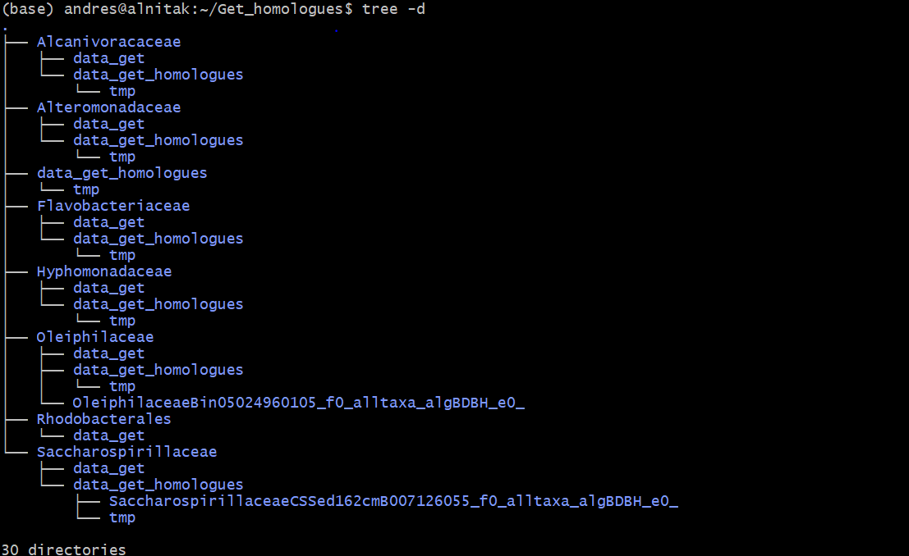

### 03/14/23

se corrio get homologues con el siguiente  script.

```{}
cat lineagelist.txt | while read line; do mkdir -p $line/data_get; ln -s /home/andres/families_DB/$line/02*/*.gbk $line/data_get; ln -s /home/andres/families_DB/$line/04*/*.faa $line/data_get; get_homologues.pl -n 20 -d $line/data_get; mv data_get_homologues $line; done

```

Y hasta el momento la estructura de las carpetas resultantes es la siguiiente:



Observaciones:

no apracen las carpetas alltaxa en todas las bases de datos, solo en Oleiphilaceae y sachrospirillaceae, que son las familias con menos genomas.


Intentaremos modificando los parametros

-f filter by %length difference within clusters                (range [1-100], by default sequence length is not 
checked)

-A tells the program to produce a tab-separated file with average % sequence identity values among pairs of genomes, computed from sequences in the final set of clusters (see also option -t ). By default these identities are derived from BLASTP alignments, and hence correspond to amino acid sequence identities. However, as explained earlier, option -a forces the program to use nucleotide sequences and run BLASTN instead, and therefore, -a 'CDS' combined -A will produce genomic average nucleotide sequence identities (ANI), as used in the literature to help define prokaryotic species (PubMed=19855009).

-z can be called when performing a genome composition analysis with clustering algorithms OMCL or COGS. In addition to the core- and pan-genome tab-separated files mentioned earlier (see option -c), this flag requests a soft-core report, considering all sequence clusters present in a fraction of genomes defined by global variable $SOFTCOREFRACTION, with a default value of 0.95. This choice produces a composition report more robust to assembly or annotation errors than the core-genome.

-t 0 con los algoritmos COG y OMCL para incluir todos los grupos posibles, teniendo en cuenta aquellos que podrían no contener secuencias de todos los genomas de entrada (taxones)

